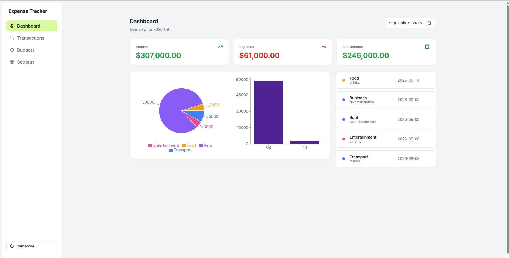
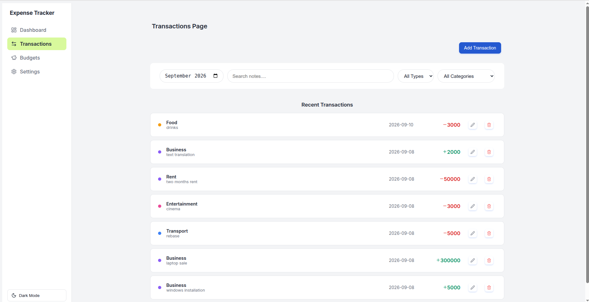
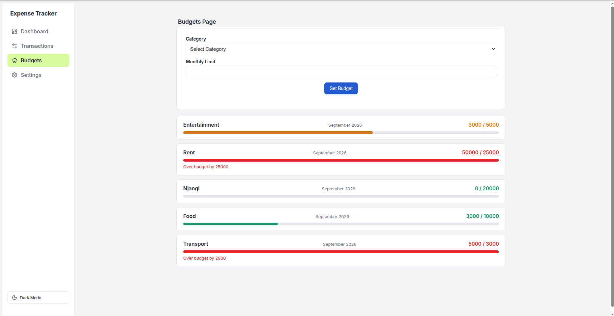
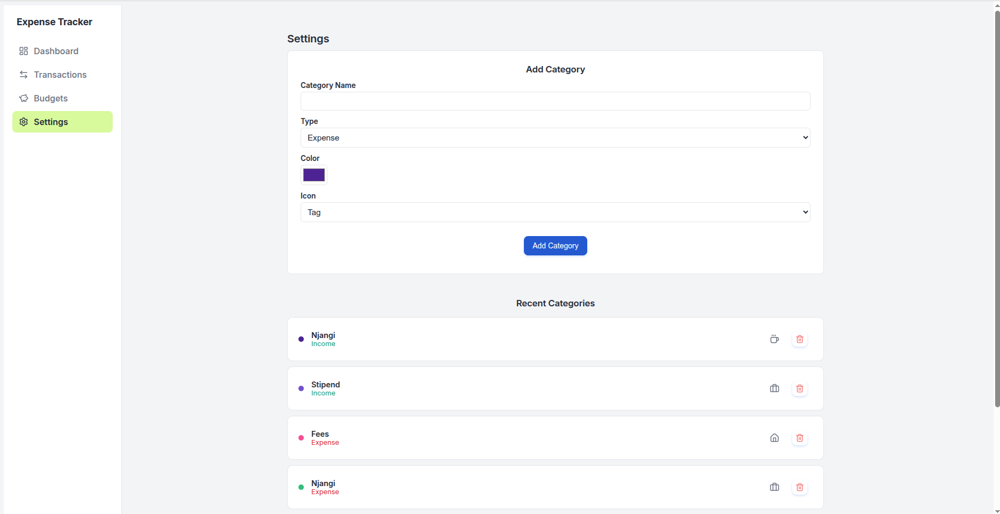
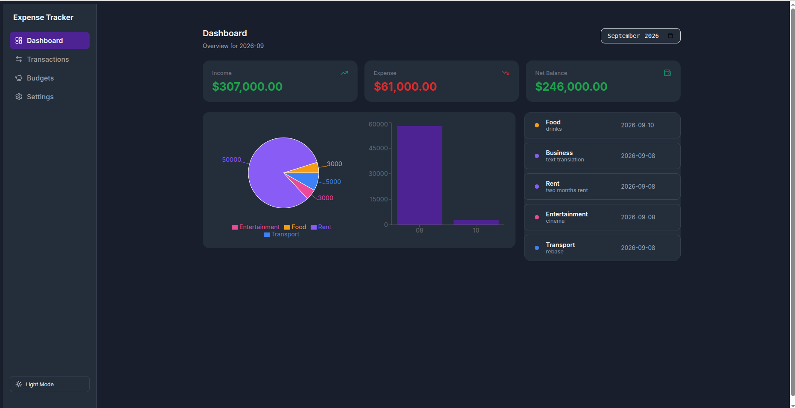

# 💰 Expense-Tracker

A personal finance app that tracks your income and expenses across months to show you your spending habits!.

## 📌 Problem Statement

Personal finance is something that most people struggle with and that is largely due to the fact that they try to track their finances in notebooks which sometimes get lost or scattered. This makes it difficult to truly get insights on their spending habits and to track where their money went to. This app solves that by providing a single platform that records transactions,income or expenses and is able to set budgets for months and track spending habits for each month.

## 🎯 Project Goals

- Record income and expense transactions with validation
- Organize transactions by default and custom categories
- Filter and search transactions by month, type, category, and note text
- Set and track monthly budgets per category with visual progress
- View a dashboard summary with totals and charts
- Persist all data locally, with a light/dark theme toggle

## 🛠 Tech Stack

**Front-end**

- React (function components, hooks)
- React Router
- Recharts (data visualisation)
- Lucide-React (icons)
- Vite

**State & Persistence**

- Context API
- Custom hooks
- Browser LocalStorage

**Tooling:**

- Git & GitHub
- oxlint (linting, enforced via GitHub Actions CI)

## 🖥 Features

- Add / edit / delete transactions with inline validation
- Default and custom categories (name, color, icon)
- Filter by month, type, and category
- Debounced search over transaction notes
- Monthly budgets per category with color-coded progress bars
  (safe / warning / over-budget) and clear over-budget warnings
- Dashboard with income/expense/net balance summary cards
- Spending-by-category (pie) and spending-over-time (bar) charts
- Light/dark theme toggle, persisted across sessions
- Empty states throughout (no transactions, no search results, no budgets)
- Fully responsive layout

## 📷 Screenshots







## 🔗 Live Demo

[Live Demo](https://expense-trackr-two.vercel.app/)

## ⚙️ Installation & Setup

Clone the repository:

```bash
git clone https://github.com/swiftnathanx2/expense-tracker.git
cd expense-tracker
```

Install dependencies:

```bash
npm install

```

Run the development server:

```bash
npm run dev

```

## 🧠 Challenges Faced

- Keeping a single shared `selectedMonth` in Context so Transactions,
  Budgets, and the Dashboard all stay in sync, rather than each page
  managing its own filter independently
- Debugging a recurring bug where transaction amounts were saved as
  strings instead of numbers, which silently broke budget and dashboard
  totals until traced back to a missing `Number()` conversion on submit
- Structuring reusable Context + custom hook patterns
  (`useLocalStorage`, `useTransactions`, `useBudgets`) so persistence
  logic lived in one place instead of being duplicated per feature
- Creating debounce logic with UseEffect.
- Making reusable components and wiring them across the system

## 📚 What I Learned

- Structuring shared application state with Context API and custom hooks
- Building a reusable `useLocalStorage` hook instead of scattering
  persistence logic across components
- Debugging real string-vs-number data bugs that don't throw errors
  but silently produce wrong output
- How to use Lucide react icons.
- How to use conditional render to show or hide certain components.
- Setting up a GitHub Actions CI workflow to enforce linting on every push

## 🔀 Tradeoffs & Decisions

- Used Context + custom hooks for state management instead of a state
  library like Redux, per the project's constraints this avoided
  prop-drilling while keeping the app dependency-light
- Charts are built with Recharts rather than hand-rolled SVG.
- Built transaction item inline inside Transactionlist to avoid refactoring the code to work in a new component.

- Rendered Transaction form as a modal for the UX appeal

## 🚀 Future Improvements

- Extract `TransactionItem` into its own component
- Add a modal for the transaction form
- Add recurring transactions or CSV export as a bonus feature

👨🏽‍💻 Author

Nyoh Jonathan Smith

Junior Fullstack Developer.

📩 Email: swiftnathan702@gmail.com
🌍 Based in Cameroon | Open to remote opportunities
